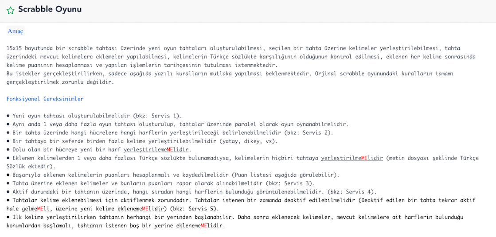
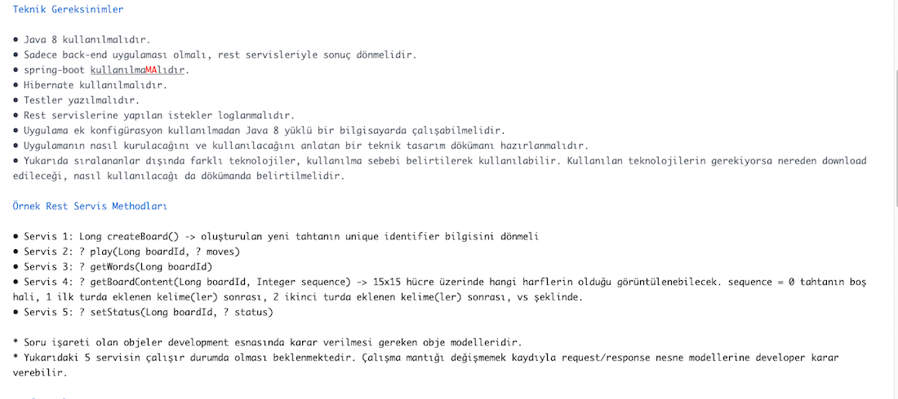
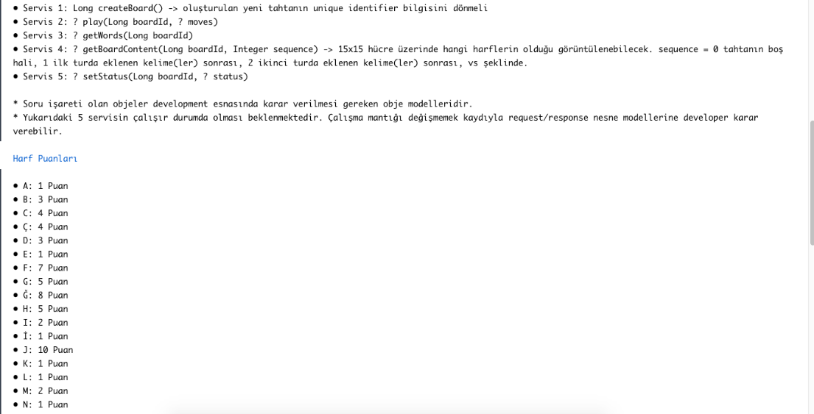
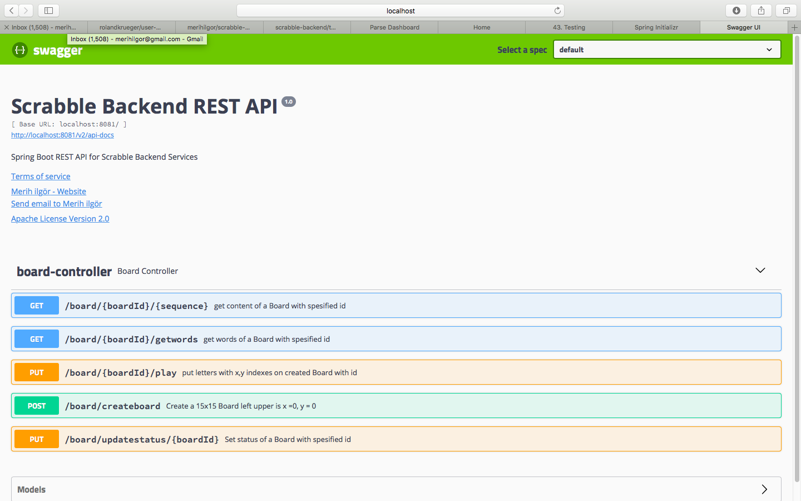

# scrabble-backend

REST API for Scrabble Backend Services consist of 5 services below according to requirements : 

createBoard    : /board/createboard
setStatus      : /board/updatestatus/{boardId}
play           : /board/{boardId}/play"
gettWords      : /board/{boardId}/getwords
getBoardContent: /board/{boardId}/{sequence}

requirements : 

P.S. Requirement for not to ese Spring boot is cancelled.

# Config :

default port is 8080 can be configured by setting

server.port=8080 value in

/src/main/resources/application.properties

# Install : 

Go to root folder of project and

mvn clean install

# Run :

go to target directory

java -jar scrabble-backend-0.0.1-SNAPSHOT.jar

# Logs:

All Request/Response Logs can be accessed by Spring actuator support via 
(JSON response, betten tu ese posttan kind of tool to view better)
http://localhost:8080/actuator/httptrace

# API Documentation 

Swagger API Documentation can be reached after running the app by

Documentation includes both sample requests and response model end example values and alsa "Try it out" button to execute Rest services.

http://localhost:8080/swagger-ui.html#/board-controller

Documentations for Used dependencies :

spring-boot-maven-plugin :
https://docs.spring.io/spring-boot/docs/current/reference/html/build-tool-plugins-maven-plugin.html

spring-boot-starter-actuator : 
https://spring.io/guides/gs/actuator-service/

spring-boot-starter-data-jpa :
https://spring.io/guides/gs/accessing-data-jpa/

spring-boot-starter-data-rest :
https://spring.io/guides/gs/accessing-data-rest/

spring-boot-starter-web
https://docs.spring.io/spring-boot/docs/current-SNAPSHOT/reference/htmlsingle/

spring-boot-starter-webflux
https://docs.spring.io/spring/docs/5.0.0.BUILD-SNAPSHOT/spring-framework-reference/html/web-reactive.html

spring-boot-starter-hateoas
https://projects.spring.io/spring-hateoas/

spring-boot-starter-test
https://docs.spring.io/spring-boot/docs/current/reference/html/boot-features-testing.html

reactor-test
https://projectreactor.io/docs

springfox-swagger2 and springfox-swagger-ui
https://springfox.github.io/springfox/docs/current/

org.apache.derby
https://db.apache.org/derby/manuals/